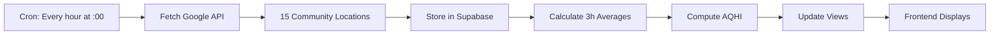

## 🎯 Google-Only AQHI System - Complete Summary

### ✅ What We Built

A clean, separated air quality system for Bangkok:

| System | Data Source | Purpose | Locations |
|--------|-------------|---------|-----------|
| **AQI Tab** | WAQI API | US EPA Air Quality Index | ~30+ stations |
| **AQHI Tab** | Google API | Thai Air Quality Health Index | 15 community points |

---

## 📦 Files Created

### 1. Database Schema
**File**: `supabase/google-aqhi-system.sql`

**What it does**:
- Creates `community_locations` table (15 fixed monitoring points)
- Creates `google_aqhi_hourly` table (stores hourly data)
- Creates functions for 3-hour averaging and AQHI calculation
- Creates views for easy data access

**Key tables**:
```sql
community_locations         -- 15 community monitoring points
google_aqhi_hourly         -- Hourly Google API data with 3h averages
latest_aqhi_by_location    -- View: Latest AQHI per location
aqhi_24h_history           -- View: 24-hour chart data
aqhi_7day_history          -- View: 7-day chart data
```

### 2. Data Collection Script
**File**: `cron-google-aqhi.js`

**What it does**:
- Fetches air quality from Google API for 15 locations
- Stores hourly readings in Supabase
- Calculates 3-hour rolling averages
- Computes AQHI using Thai formula

**Run schedule**: Every hour at :00 minutes (e.g., 08:00, 09:00, 10:00)

### 3. Setup Guide
**File**: `GOOGLE-AQHI-SETUP.md`

Complete instructions for:
- Environment setup
- Database initialization
- Cron job configuration (4 options)
- Testing and monitoring
- Troubleshooting

---

## 🔄 Data Flow



### Detailed Flow

1. **Hour 08:00** - Cron triggers
2. **API Call** - Fetch data from Google for all 15 locations
3. **Store Raw Data** - Insert into `google_aqhi_hourly`
4. **Calculate Averages** - For 08:00, average of 06:00 + 07:00 + 08:00
5. **Compute AQHI** - Apply Thai formula to averaged pollutants
6. **Update Record** - Store 3h averages and AQHI in same row
7. **Views Updated** - Latest AQHI available for frontend

---

## 🧮 AQHI Calculation

### Thai AQHI Formula

```javascript
// 1. Calculate Percentage Excess Risk for each pollutant
%ER_PM2.5 = 100 × (e^(0.0022 × PM2.5) - 1)
%ER_PM10  = 100 × (e^(0.0009 × PM10) - 1)
%ER_O3    = 100 × (e^(0.001 × O3) - 1)      // O3 in ppb
%ER_NO2   = 100 × (e^(0.003 × NO2) - 1)     // NO2 in ppb

// 2. Total Percentage Excess Risk
Total %ER = %ER_PM2.5 + %ER_PM10 + %ER_O3 + %ER_NO2

// 3. AQHI
AQHI = (10 / 105.19) × Total %ER
```

### AQHI Categories

| AQHI | Category | Color | Thai | Health Advice |
|------|----------|-------|------|---------------|
| 0-3 | Low | 🟢 Green | ต่ำ | Ideal for outdoor activities |
| 4-6 | Moderate | 🟡 Yellow | ปานกลาง | Normal activities OK |
| 7-9 | High | 🔴 Red | สูง | Reduce vigorous activities |
| 10+ | Very High | 🟤 Dark Red | สูงมาก | Avoid outdoor activities |

---

## 📍 15 Community Monitoring Locations

| ID | Location Name | District | Lat | Lng |
|----|---------------|----------|-----|-----|
| 1 | มัสยยิดบ้านตึกดิน | พระนคร | 13.758108 | 100.500366 |
| 2 | หลังศูนย์จันทร์ฉิมไพบูลย์ | ธนบุรี | 13.720943 | 100.481581 |
| 3 | ปลายซอยศักดิ์เจริญ | บางกอกใหญ่ | 13.733446 | 100.463527 |
| 4 | ซอยท่าดินแดง 14 และ 16 | คลองสาน | 13.735493 | 100.504763 |
| 5 | วัดไชยทิศ | บางกอกน้อย | 13.768083 | 100.463323 |
| 6 | รักเจริญ | หนองแขม | 13.716707 | 100.355342 |
| 7 | หมู่ 7 ราษฎร์บูรณะ | ราษฎร์บูรณะ | 13.66671 | 100.515025 |
| 8 | ชุมชนสวัสดี | ดินแดง | 13.772018 | 100.558131 |
| 9 | สาหร่ายทองคำ | พระโขนง | 13.701217 | 100.612882 |
| 10 | นันทวันเซ็นต์ 2 | หนองจอก | 13.845409 | 100.88052 |
| 11 | ซอยพระเจน | ปทุมวัน | 13.731048 | 100.546676 |
| 12 | มัสยิดมหานาค | ป้อมปราบศัตรูพ่าย | 13.752959 | 100.515871 |
| 13 | ชุมชนสะพานหัน | สัมพันธวงศ์ | 13.74281 | 100.502217 |
| 14 | บ้านมั่นคงฟ้าใหม่ | บางพลัด | 13.79493179 | 100.5014054 |
| 15 | บ่อฝรั่งริมน้ำ | จตุจักร | 13.82163586 | 100.5425091 |

---

## 🚀 Quick Start

### 1. Setup Database

Run in Supabase SQL Editor:
```bash
supabase/google-aqhi-system.sql
```

### 2. Configure Environment

Add to `.env.local`:
```bash
SUPABASE_URL=your-url
SUPABASE_SERVICE_ROLE_KEY=your-key
GOOGLE_AIR_QUALITY_API_KEY=your-google-key
```

### 3. Test Collection

```bash
node cron-google-aqhi.js
```

### 4. Setup Cron

Choose one:
- **PM2** (recommended): `pm2 start cron-scheduler.js`
- **System Cron**: `0 * * * * node cron-google-aqhi.js`
- **Windows Task Scheduler**: Hourly task
- **Supabase pg_cron**: SQL-based scheduling

### 5. Verify

```sql
SELECT * FROM latest_aqhi_by_location;
```

---

## 📊 Expected Data Structure

### Hourly Reading Example

```javascript
{
  location_id: 1,
  hour_timestamp: '2024-01-15T08:00:00Z',
  pm25: 45.2,              // μg/m³ (raw)
  pm10: 67.8,              // μg/m³ (raw)
  o3: 32.1,                // ppb (raw)
  no2: 18.5,               // ppb (raw)
  pm25_3h_avg: 42.3,       // 3-hour average
  pm10_3h_avg: 64.5,       // 3-hour average
  o3_3h_avg: 30.8,         // 3-hour average
  no2_3h_avg: 17.2,        // 3-hour average
  aqhi: 4.2,               // Calculated from 3h averages
  aqhi_category: 'MODERATE'
}
```

---

## 🎯 Benefits

### ✅ Clean Separation
- **AQI** (WAQI) and **AQHI** (Google) are completely independent
- No confusion between different air quality indices
- Each system optimized for its purpose

### ✅ Accurate AQHI
- 3-hour rolling averages (more accurate than instant readings)
- Thai AQHI formula (localized for Bangkok)
- Real pollutant concentrations (not AQI conversions)

### ✅ Community Focus
- 15 fixed locations representing Bangkok communities
- Consistent monitoring points for trend analysis
- Population-weighted locations

### ✅ Efficient System
- Hourly collection (not overwhelming Google API)
- Server-side calculations (no client load)
- Automatic cleanup (7-day retention)
- Fast queries with indexed views

---

## 📈 Next Steps

### Frontend Integration

```javascript
// Example: Display AQHI on map
const { data } = await supabase
  .from('latest_aqhi_by_location')
  .select('*');

data.forEach(loc => {
  L.marker([loc.latitude, loc.longitude])
    .bindPopup(`
      <h3>${loc.location_name}</h3>
      <p>AQHI: ${loc.aqhi} (${loc.aqhi_category})</p>
      <p>PM2.5: ${loc.pm25_3h_avg?.toFixed(1)} μg/m³</p>
    `)
    .addTo(map);
});
```

### Charts

```javascript
// Example: 24-hour AQHI chart
const { data: history } = await supabase
  .from('aqhi_24h_history')
  .select('*')
  .eq('location_id', 1)
  .order('hour_timestamp');

// Use with Chart.js, Recharts, etc.
```

---

## ⚙️ System Requirements

- **Node.js**: v18+
- **Supabase**: Free tier OK
- **Google Cloud**: Air Quality API enabled
- **Cron**: Any system (PM2, system cron, Windows Task Scheduler, pg_cron)

---

## 📞 Support

**Files to check**:
1. `GOOGLE-AQHI-SETUP.md` - Detailed setup guide
2. `supabase/google-aqhi-system.sql` - Database schema
3. `cron-google-aqhi.js` - Collection script

**Common issues**:
- API key not working → Check Google Cloud Console
- No data collected → Run `node cron-google-aqhi.js` manually
- AQHI not calculated → Need at least 1 hour of data

---

## ✨ Summary

You now have a **production-ready Google-only AQHI system** that:

✅ Collects data hourly from 15 community locations
✅ Calculates accurate 3-hour rolling averages
✅ Computes Thai AQHI using proper formula
✅ Stores data efficiently in Supabase
✅ Provides easy-to-use views for frontend
✅ Runs automatically 24/7
✅ Completely separated from WAQI AQI system

**Ready to deploy!** 🚀
