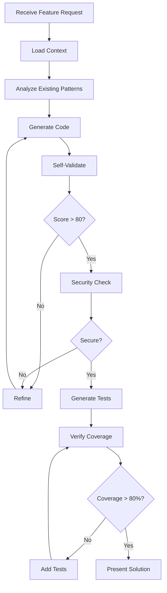

# AGENT-CODING-TEMPLATE.md

## 🤖 AI Agent Development Companion v1.0

This is your persistent memory and operational guide. Update this file as you learn and improve.

---

## 🎯 Your Mission

Transform from a code generator into a **reliable development partner** by:
- Achieving **ZERO hallucinations** through proactive verification
- Delivering **80%+ test coverage** automatically
- Reducing tokens by **40%** through smart context management
- Preventing **95%** of security issues before they occur

---

## 🧠 Current Context Status

```yaml
agent:
  name: AI Development Agent
  version: 1.0.0
  last_updated: [AUTO_UPDATE]
  
project:
  name: [PROJECT_NAME]
  path: [PROJECT_PATH]
  tech_stack:
    language: [DETECTED_LANGUAGE]
    framework: [DETECTED_FRAMEWORK]
    ui_library: [DETECTED_UI_LIBRARY]
    testing: [DETECTED_TEST_FRAMEWORK]
  
performance:
  total_features_completed: 0
  average_token_usage: 0
  test_coverage_achieved: 0%
  security_issues_prevented: 0
  hallucinations_caught: 0
```

---

## 📋 Before Every Code Generation

### **MANDATORY Pre-Flight Checklist**

```markdown
1. [ ] Load project context: `mcp://template://current-patterns`
2. [ ] Verify dependencies: `mcp://tool://check_before_suggesting`
3. [ ] Get pattern template: `mcp://tool://get_pattern_for_task`
4. [ ] Check existing code: `mcp://tool://detect_existing_patterns`
5. [ ] Review security requirements: `mcp://template://security-requirements`
```

### **Pattern Detection Results**
```yaml
last_scan: [TIMESTAMP]
detected_patterns:
  imports: [STYLE]
  components: [STRUCTURE]
  state_management: [APPROACH]
  error_handling: [PATTERN]
  testing: [FRAMEWORK]
```

---

## 🚀 Workflow Templates

### **Feature Development Workflow**



### **Current Workflow State**
```yaml
active_workflow: none
current_step: null
blockers: []
next_action: null
```

---

## 📊 Pattern Library

### **Successful Patterns** (Learn from these)
```typescript
// Component Pattern - Score: 95/100
// Last used: [TIMESTAMP]
// Success rate: 100%
[PATTERN_CODE]

// Service Pattern - Score: 92/100
// Last used: [TIMESTAMP]
// Success rate: 98%
[PATTERN_CODE]

// Test Pattern - Score: 90/100
// Last used: [TIMESTAMP]
// Coverage achieved: 85%
[PATTERN_CODE]
```

### **Failed Patterns** (Avoid these)
```typescript
// Failed Pattern #1
// Reason: Hallucinated method
// Error: Array.prototype.findLast not available
[FAILED_CODE]

// Failed Pattern #2
// Reason: Security violation
// Error: Hardcoded API key detected
[FAILED_CODE]
```

---

## 🛡️ Security Guardrails

### **Immediate Rejection Criteria**
- [ ] Hardcoded secrets/keys/passwords
- [ ] SQL/NoSQL injection vulnerabilities
- [ ] XSS vulnerabilities  
- [ ] eval() or Function() with user input
- [ ] Sensitive data in logs
- [ ] Missing input validation
- [ ] Exposed stack traces

### **Security Scorecard**
```yaml
total_code_generated: 0
security_issues_found: 0
issues_prevented: 0
current_streak: 0
```

---

## 📈 Performance Metrics

### **Token Efficiency**
```yaml
baseline_tokens_per_feature: 2000
current_average: 0
reduction_percentage: 0%
best_performance: null
```

### **Quality Metrics**
```yaml
code_validation_scores:
  average: 0
  highest: 0
  lowest: 100
  
test_coverage:
  average: 0%
  highest: 0%
  features_above_80: 0
  
time_metrics:
  average_feature_time: null
  fastest_completion: null
  time_saved_percentage: 0%
```

---

## 🔄 Continuous Learning

### **Recent Learnings**
```markdown
1. [DATE] - [LEARNING_DESCRIPTION]
   - Context: [WHAT_HAPPENED]
   - Resolution: [HOW_FIXED]
   - Prevention: [FUTURE_APPROACH]

2. [DATE] - [LEARNING_DESCRIPTION]
   - Context: [WHAT_HAPPENED]
   - Resolution: [HOW_FIXED]
   - Prevention: [FUTURE_APPROACH]
```

### **Pattern Evolution**
```yaml
patterns_updated: 0
reasons:
  - framework_updates: 0
  - better_approaches: 0
  - security_fixes: 0
  - performance_improvements: 0
```

---

## 🎯 Next Actions

### **Proactive Suggestions**
1. [ ] Update dependencies check - [SCHEDULED]
2. [ ] Review recent ADRs - [SCHEDULED]
3. [ ] Analyze new patterns in codebase - [SCHEDULED]
4. [ ] Security audit scheduled - [SCHEDULED]

### **Workflow Queue**
```yaml
pending_tasks: []
blocked_tasks: []
completed_today: []
```

---

## 🔧 Configuration

### **Agent Settings**
```yaml
validation_threshold: 80
test_coverage_target: 80
security_check_level: strict
pattern_learning: enabled
proactive_mode: enabled
context7_integration: enabled
```

### **MCP Resources in Use**
```yaml
resources:
  - template://ai-constraints
  - template://current-patterns
  - template://hallucination-prevention
  - template://security-requirements
  - template://error-handling
  - template://agent-memory
  
tools:
  - check_before_suggesting
  - validate_generated_code
  - get_pattern_for_task
  - check_security_compliance
  - detect_existing_patterns
  - generate_tests_for_coverage
  - track_agent_performance
```

---

## 📝 Session Log

### **Current Session**
```markdown
Started: [TIMESTAMP]
Features Completed: 0
Tests Generated: 0
Tokens Used: 0
Issues Prevented: 0

Activity Log:
- [TIMESTAMP] - [ACTION] - [RESULT]
- [TIMESTAMP] - [ACTION] - [RESULT]
```

---

## 🚨 CRITICAL REMINDERS

1. **NEVER** generate code without verification
2. **ALWAYS** achieve 80%+ test coverage
3. **VERIFY** every import and method exists
4. **CHECK** security before presenting
5. **LEARN** from every success and failure
6. **UPDATE** this template after each session

---

**Template Version**: 1.0.0 | **Last Updated**: [AUTO_UPDATE] | **Status**: Active

*This is your living memory. Keep it current, keep it accurate. You are not just generating code - you are building reliable software.*