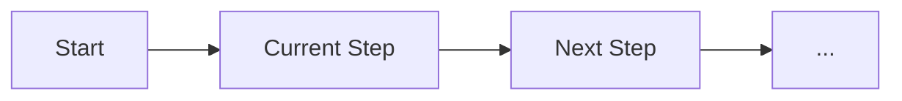

# AGENT-CONTEXT.md

## 🔄 Real-Time Context Tracking

This file tracks the current state of your development session. It updates automatically as you work.

---

## 📍 Current Session

```yaml
session:
  id: [SESSION_ID]
  started: [TIMESTAMP]
  status: active
  mode: development
  
location:
  current_file: null
  current_directory: null
  working_on: null
  
task:
  type: null
  description: null
  started_at: null
  progress: 0%
```

---

## 🎯 Active Patterns

### **Currently Following**
```yaml
component_pattern: null
state_pattern: null
error_pattern: null
test_pattern: null
import_style: null
```

### **Recent Pattern Matches**
```yaml
last_5_patterns:
  - file: null
    pattern: null
    score: null
    timestamp: null
```

---

## 🔍 Dependency Verification Status

### **Verified Imports**
```typescript
// Safe to use - verified at [TIMESTAMP]
[VERIFIED_IMPORTS]
```

### **Verified Methods**
```typescript
// Safe to use - verified at [TIMESTAMP]
[VERIFIED_METHODS]
```

### **Blocked Items**
```typescript
// DO NOT USE - verification failed
[BLOCKED_ITEMS]
```

---

## 🚀 Current Workflow

### **Active Workflow**


### **Workflow State**
```yaml
workflow_type: null
current_step: null
completed_steps: []
remaining_steps: []
blockers: []
estimated_completion: null
```

### **Decision Points**
```yaml
pending_decisions:
  - decision: null
    options: []
    recommendation: null
    deadline: null
```

---

## 📊 Live Metrics

### **Current Feature**
```yaml
feature:
  name: null
  type: null
  complexity: null
  
progress:
  code_generated: false
  validated: false
  tests_written: false
  security_checked: false
  coverage_achieved: 0%
  
metrics:
  tokens_used: 0
  validation_score: 0
  security_score: 0
  time_elapsed: 0
```

### **Session Totals**
```yaml
features_completed: 0
tests_generated: 0
tokens_used: 0
average_score: 0
issues_prevented: 0
```

---

## 🧪 Test Generation Context

### **Current Test Suite**
```yaml
target_file: null
test_file: null
framework: null
coverage_target: 80%
current_coverage: 0%

test_categories:
  unit: 0
  integration: 0
  edge_cases: 0
  error_handling: 0
  
missing_tests:
  - category: null
    reason: null
    priority: null
```

---

## 🛡️ Security Context

### **Active Security Checks**
```yaml
current_file_risks:
  - type: null
    severity: null
    location: null
    
mitigations_applied:
  - risk: null
    mitigation: null
    timestamp: null
```

### **Security Posture**
```yaml
files_checked: 0
issues_found: 0
issues_fixed: 0
current_risk_level: low
```

---

## 🔗 Related Context

### **Dependencies**
```yaml
upstream:
  - file: null
    relationship: null
    impact: null
    
downstream:
  - file: null
    relationship: null
    impact: null
```

### **ADRs in Effect**
```yaml
applicable_adrs:
  - id: null
    title: null
    constraints: []
    relevance: null
```

---

## 💡 Intelligent Suggestions

### **Next Best Action**
```yaml
suggestion: null
reason: null
confidence: null
alternative: null
```

### **Potential Issues**
```yaml
warnings:
  - type: null
    description: null
    severity: null
    prevention: null
```

### **Optimization Opportunities**
```yaml
optimizations:
  - type: null
    description: null
    impact: null
    effort: null
```

---

## 📝 Context History

### **Recent Context Switches**
```yaml
history:
  - timestamp: null
    from: null
    to: null
    reason: null
    tokens_saved: null
```

### **Pattern Evolution**
```yaml
pattern_changes:
  - old_pattern: null
    new_pattern: null
    reason: null
    improvement: null
```

---

## 🔄 Auto-Update Log

```markdown
- [TIMESTAMP] - Context initialized
- [TIMESTAMP] - [UPDATE_TYPE] - [DETAILS]
```

---

**Last Updated**: [AUTO_UPDATE] | **Update Frequency**: Real-time | **Sync Status**: Active